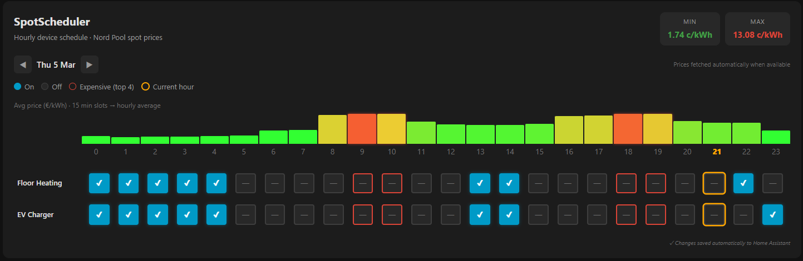
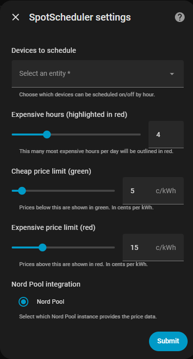

# SpotScheduler

> Manually schedule Home Assistant devices by hour based on Nord Pool spot electricity prices.



SpotScheduler adds a Lovelace card that shows today's (and tomorrow's) hourly electricity prices as a bar chart and lets you click each cell to schedule a device **on** or **off** for that hour. Schedules are stored persistently and executed automatically at the start of each hour.

**Requires:** Home Assistant 2024.12+ with the built-in [Nord Pool integration](https://www.home-assistant.io/integrations/nordpool/).

---

## Features

- 📊 **Hourly price chart** — 15-minute MTU slots are averaged into hourly prices
- 🔴 **Expensive hours highlighted** — configurable count, default 3 most expensive per day
- 📅 **Day min / max price** shown in the card header
- ✅ **Per-device hourly toggle** — On / Off / Unset for every device and hour
- 📆 **Multi-day view** — navigate to tomorrow's schedule when prices are available (up to 7 days back)
- 💾 **Persistent schedules** — saved to HA storage, survive restarts, included in HA backups
- ⏰ **Automatic execution** — devices are turned on/off at the start of each scheduled hour
- 🌐 **Multilingual UI** — follows your HA profile language setting (English / Finnish)
- 🔔 **HA Repairs integration** — actionable alerts if Nord Pool becomes unavailable
- 🕛 **Midnight cleanup** — old schedule data pruned automatically

---

## How price fetching works

SpotScheduler uses the Nord Pool integration's `nordpool.get_prices_for_date` service action:

| Event | Action |
|---|---|
| HA startup | Fetch today's prices |
| Every 15 min after 13:00 local time | Poll for tomorrow's prices (stops once fetched) |
| Any Nord Pool sensor state change | Opportunistically try fetching tomorrow's prices |
| Midnight | Fetch fresh prices for the new day, prune old data |

Tomorrow's prices in the Nordics are typically published between **13:00–15:00 CET** (14:00–16:00 EET in Finland). SpotScheduler polls for them every 15 minutes starting at 13:00 local time and also reacts to any Nord Pool sensor update. Once tomorrow's prices are fetched, polling stops until the next day.


---

## Requirements

| Requirement | Version |
|---|---|
| Home Assistant | 2024.12.0+ |
| Nord Pool (built-in) | included in HA 2024.12+ |
| HACS | 1.0+ (for HACS install) |

> **Note:** This integration uses the **built-in** Nord Pool integration, not the old HACS custom component. Make sure Nord Pool is set up under *Settings → Devices & Services* before installing SpotScheduler.

---

## Installation

### Via HACS (recommended)

1. Open HACS → **Integrations** → ⋮ → **Custom repositories**
2. Add `https://github.com/nstrandm/spot-scheduler` → category **Integration**
3. Find **SpotScheduler** and click **Download**
4. **Restart Home Assistant**
5. Go to **Settings → Devices & Services → + Add integration → SpotScheduler**

The Lovelace card JS resource is registered automatically when the integration starts — no manual resource registration needed.

### Manual installation

1. Copy the `custom_components/spot_scheduler/` folder to your HA `config/custom_components/` directory
2. Copy the `www/spot-scheduler-card.js` file to `config/custom_components/spot_scheduler/www/`
3. **Restart Home Assistant**
4. Go to **Settings → Devices & Services → + Add integration → SpotScheduler**

The card resource is registered automatically on first startup. If auto-registration fails (e.g. YAML-mode dashboards), add the resource manually:

**Settings → Dashboards → ⋮ → Resources → Add resource:**

| Field | Value |
|---|---|
| URL | `/api/spot_scheduler/static/spot-scheduler-card.js` |
| Type | JavaScript module |

---

## Setup

### Settings



Pick devices from HA's entity list. Supported domains: `switch`, `light`, `climate`, `input_boolean`.

Choose the Nord Pool integration entry, give the integration a name, and set how many of the most expensive hours to highlight in red. Set limits for cheap and expensive prices.

### Changing settings later

Go to **Settings → Devices & Services → SpotScheduler → Configure** to modify devices and the expensive hours threshold at any time. Changes take effect immediately after saving.

---

## Adding the card to your dashboard

1. Open your dashboard → **Edit** (pencil icon) → **+ Add card**
2. Search for **SpotScheduler** in the card picker, or choose **Manual** and paste:

```yaml
type: custom:spot-scheduler-card
devices:
  - switch.washing_machine
  - switch.ev_charger
  - climate.floor_heating
expensive_hours: 3
```

### Card options

| Option | Type | Default | Description |
|---|---|---|---|
| `devices` | list | **required** | Entity IDs to schedule |
| `expensive_hours` | int | `3` | Most expensive hours to highlight in red |
| `title` | string | `"SpotScheduler"` | Card title (overrides translated default) |
| `label_width` | int | `120` | Width in px of the device name column |
| `status_entity` | string | auto-detected | Override the sensor used to read prices/schedules |

> **Important:** The `devices` list in the card configuration must match the devices you selected during integration setup. The card reads schedule data from the integration — it does not control devices on its own.

---

## Daily use

1. **Prices for tomorrow** appear automatically after Nord Pool publishes them (typically ~14:00–16:00 EET for Finland)
2. Open your dashboard — the bar chart shows hourly average prices
3. The **most expensive hours** are highlighted with a red border
4. **Click a cell** to toggle a device for that hour:
   - **✓ blue** — device will turn **on** at the start of that hour
   - **✕ grey** — device will turn **off** at the start of that hour
   - **empty** — not scheduled (device keeps its current state)
5. Use **◀ ▶** to navigate between days (up to 7 days back, 1 day forward)

---

## Sensors created

| Entity | Description |
|---|---|
| `sensor.spotscheduler_current_price` | Current hour average price (EUR/kWh) |
| `sensor.spotscheduler_min_price` | Today's lowest hourly price |
| `sensor.spotscheduler_max_price` | Today's highest hourly price |
| `sensor.spotscheduler_schedule_status` | Number of ON-hours scheduled today; attributes include full price and schedule data used by the card |

Each sensor belongs to the SpotScheduler device and updates automatically when prices arrive or schedules change.

---

## Services

### `spot_scheduler.set_device_schedule`

Set a device schedule slot (also called by the card automatically when you click a cell).

```yaml
service: spot_scheduler.set_device_schedule
data:
  date: "2026-03-05"          # ISO date, defaults to today
  hour: 2                     # 0–23
  device_id: switch.ev_charger
  enabled: true               # true = on, false = off
```

### `spot_scheduler.refresh_prices`

Force a price refresh for a specific date. Fetches for all configured SpotScheduler instances.

```yaml
service: spot_scheduler.refresh_prices
data:
  date: "2026-03-05"          # defaults to today
```

These services are visible with full field descriptions in **Developer Tools → Services**.

---

## Troubleshooting

### Card shows "Waiting for today's prices from Nord Pool"

- Verify Nord Pool is working: check **Developer Tools → States** for `sensor.nordpool_*` entities
- Try **Developer Tools → Services → `spot_scheduler.refresh_prices`**
- Check the HA log for errors containing `spot_scheduler`

### Card doesn't appear in the card picker

- Verify the integration is running: **Settings → Devices & Services → SpotScheduler**
- Clear browser cache (`Ctrl+Shift+R`)
- If using YAML-mode dashboards, add the resource manually (see Installation section)

### "Nord Pool integration removed" Repairs alert

The linked Nord Pool config entry was deleted. Re-add Nord Pool under **Settings → Devices & Services**, then reload SpotScheduler.

### Schedule toggles don't persist

Check that the device entity IDs in your card config match those in the integration setup. If you changed devices via **Configure**, you may need to update the card YAML as well.

### Devices don't turn on/off at the scheduled time

- SpotScheduler sends `homeassistant.turn_on` / `turn_off` at `HH:00:30` each hour
- Verify the target device responds to these service calls in Developer Tools
- Check the HA log for `Schedule: ON` / `Schedule: OFF` messages

---

## Languages

The card language follows the **HA user profile** setting (`hass.locale.language`).

| Language | Code | Status |
|---|---|---|
| English | `en` | ✅ |
| Finnish | `fi` | ✅ |

To add a new language, add an entry to the `TRANSLATIONS` object in `www/spot-scheduler-card.js` and a new file under `custom_components/spot_scheduler/translations/`.
