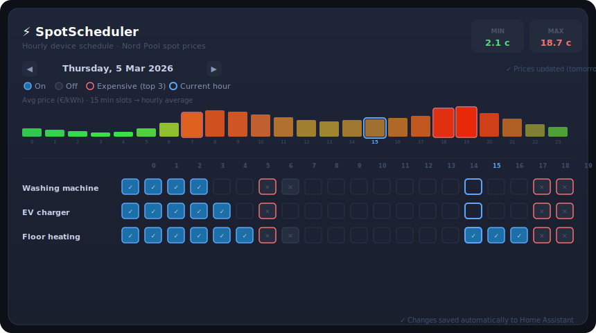
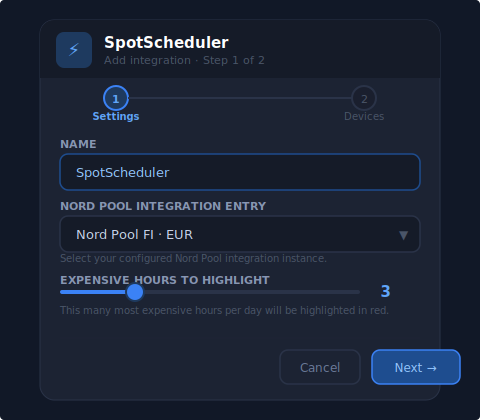
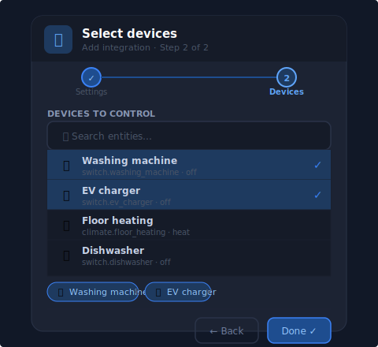

# SpotScheduler

> Manually schedule Home Assistant devices by hour based on Nord Pool spot electricity prices.



SpotScheduler adds a Lovelace card that shows today's (and tomorrow's) hourly electricity prices as a bar chart and lets you click each cell to schedule a device **on** or **off** for that hour. Schedules are stored persistently and executed automatically at the start of each hour.

**Requires:** Home Assistant 2024.12+ with the built-in [Nord Pool integration](https://www.home-assistant.io/integrations/nordpool/).

---

## Features

- 📊 **Hourly price chart** — 15-minute MTU slots are averaged into hourly prices
- 🔴 **Expensive hours highlighted** — configurable count, default 3 most expensive per day
- 📅 **Day min / max price** shown in the card header
- ✅ **Per-device hourly toggle** — On / Off / Unset for every device and hour
- 📆 **Multi-day view** — navigate to tomorrow's schedule as soon as prices are available
- 💾 **Persistent schedules** — saved to HA storage, survive restarts, included in HA backups
- ⏰ **Automatic execution** — devices are turned on/off at the start of each scheduled hour
- 🌐 **Multilingual UI** — follows your HA profile language setting (English / Finnish)
- 🔔 **HA Repairs integration** — actionable alerts if Nord Pool becomes unavailable
- 🕛 **Midnight cleanup** — old schedule data pruned automatically

---

## How price fetching works

SpotScheduler uses the Nord Pool integration's built-in action `nordpool.get_prices_for_date`:

| Event | Action |
|---|---|
| HA startup | Fetch today's prices |
| Nord Pool `tomorrow_valid` flips `false → true` | Fetch tomorrow's prices immediately |
| Midnight | Fetch fresh prices for the new day, prune old data |

Tomorrow's prices in Finland are typically published between **14:00–16:00 EET**. SpotScheduler detects this automatically by watching the `tomorrow_valid` attribute on the Nord Pool sensor — no hardcoded clock times.

---

## Requirements

| Requirement | Version |
|---|---|
| Home Assistant | 2024.12.0+ |
| Nord Pool (built-in) | included in HA 2024.12+ |
| HACS | 1.0+ |

> **Note:** This integration uses the **built-in** Nord Pool integration, not the old HACS custom component. Make sure Nord Pool is set up under *Settings → Devices & Services* before installing SpotScheduler.

---

## Installation

### Via HACS (recommended)

1. Open HACS → **Integrations** → ⋮ → **Custom repositories**
2. Add `https://github.com/yourusername/spot-scheduler` → category **Integration**
3. Find **SpotScheduler** and click **Download**
4. Restart Home Assistant

### Register the Lovelace card resource

Go to **Settings → Dashboards → ⋮ → Resources → Add resource**:

| Field | Value |
|---|---|
| URL | `/hacsfiles/spot_scheduler/spot-scheduler-card.js` |
| Type | JavaScript module |

Or add to `configuration.yaml`:

```yaml
lovelace:
  resources:
    - url: /hacsfiles/spot_scheduler/spot-scheduler-card.js
      type: module
```

---

## Setup

### Step 1 — Settings



Choose the Nord Pool integration entry, give the integration a name, and set how many of the most expensive hours to highlight in red.

### Step 2 — Select devices



Pick devices from HA's entity list. Supported domains: `switch`, `light`, `climate`, `input_boolean`. You can change this list at any time via **Settings → Devices & Services → SpotScheduler → Configure**.

---

## Adding the card to your dashboard

```yaml
type: custom:spot-scheduler-card
devices:
  - switch.washing_machine
  - switch.ev_charger
  - climate.floor_heating
expensive_hours: 3
```

### Card options

| Option | Type | Default | Description |
|---|---|---|---|
| `devices` | list | **required** | Entity IDs to schedule |
| `expensive_hours` | int | `3` | Most expensive hours to highlight in red |
| `title` | string | `"SpotScheduler"` | Card title (overrides translated default) |
| `label_width` | int | `120` | Width in px of the device name column |
| `status_entity` | string | auto-detected | Override the sensor used to read prices/schedules |

---

## Daily use

1. **Prices for tomorrow** appear automatically after Nord Pool publishes them (~14:00–16:00 EET for Finland)
2. Open your dashboard — the bar chart shows hourly average prices
3. The **most expensive hours** are highlighted with a red border
4. **Click a cell** to toggle a device for that hour:
   - **✓ blue** — device will turn **on** at the start of that hour
   - **✕ grey** — device will turn **off** at the start of that hour
   - **empty** — not scheduled (device keeps its current state)
5. Use **◀ ▶** to navigate between days

---

## Sensors created

| Entity | Description |
|---|---|
| `sensor.spot_scheduler_current_price` | Current hour average price (EUR/kWh) |
| `sensor.spot_scheduler_min_price` | Today's lowest hourly price |
| `sensor.spot_scheduler_max_price` | Today's highest hourly price |
| `sensor.spot_scheduler_schedule_status` | ON-hours scheduled today; attributes include full price and schedule data used by the card |

---

## Services

```yaml
# Set a device schedule slot (also called by the card automatically)
service: spot_scheduler.set_device_schedule
data:
  date: "2026-03-05"     # ISO date, defaults to today
  hour: 2                # 0–23
  device_id: switch.ev_charger
  enabled: true          # true = on, false = off

# Force a price refresh for a specific date
service: spot_scheduler.refresh_prices
data:
  date: "2026-03-05"     # defaults to today
```

---

## Languages

The card language follows the **HA user profile** setting (`hass.locale.language`).

| Language | Code | Status |
|---|---|---|
| English | `en` | ✅ |
| Finnish | `fi` | ✅ |

To add a new language, add an entry to the `TRANSLATIONS` object in `www/spot-scheduler-card.js` and a new file under `custom_components/spot_scheduler/translations/`.

---

## Changelog

### 1.8.0 — current
Initial release.
